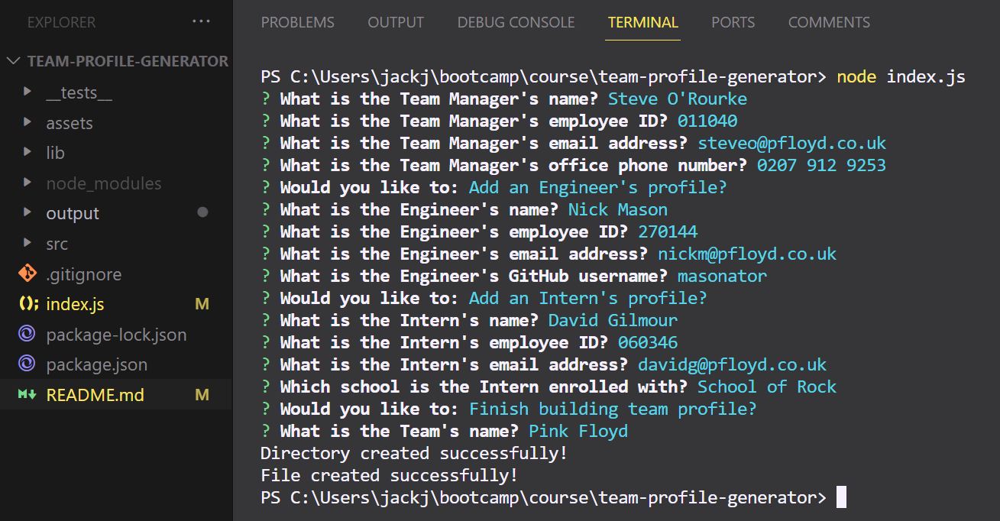

# Jack Johnson's Team Profile Generator

## Description

A command-line application that takes in information about employees on a software engineering team, then generates an HTML webpage that displays summaries for each person.

## Table of Contents

- [Installation](#installation)
- [Usage](#usage)
- [Credits](#credits)
- [License](#license)

## Installation

- Install node.js on your system.
- Save the Team Profile Generator code to your hard drive.
- In the terminal, navigate to the root folder for the application and enter "npm install".
- Type "node index.js" to run the application.

## Usage

- Answer the questions to create the Team Manager's profile
- Once completed, you will be asked if you want to add an Engineer / Intern to the team, or if you want to finish.
- If you choose to add a new employee, answer the questions that follow to create their profile.
- Repeat until you have finished creating a profile for every team member.
- Upon completion you will be asked to give your Team a name.
- Finally your HTML file will be created and saved in the folder called "output". 
- Right click the file and click "Open in Default Browser" to view your team profile.

## Credits

I would like to acknowledge my peers in Sibert-pod-11. We're all on the same learning journey and have helped each other massively during the front-end web development skills boot camp.

## License

No license chosen
